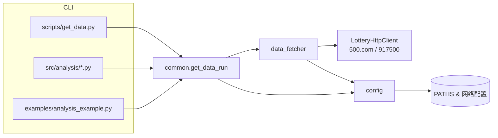

# 架构总览

## 模块说明
- **CLI 与脚本层**：包含下载脚本、分析脚本与示例；通过 `src.common` 统一访问内部能力。
- **`src.common`**：提供数据下载与期号查询的高层接口，同时复用 `data_fetcher` 和 `config`。
- **`src.data_fetcher`**：负责 HTTP 请求、HTML/文本解析以及 CSV 写入，仅支持快乐 8。
- **`src.config`**：集中维护路径、网络超时及彩票配置；`ensure_runtime_directories` 用于初始化运行目录。

## 数据流
1. CLI 解析参数后调用 `get_data_run` 或 `load_history`。
2. `common` 根据配置创建目录并委托 `data_fetcher` 执行网络请求。
3. `data_fetcher` 使用带重试的 `LotteryHttpClient` 抓取数据，解析后写入 `data/kl8/data.csv`。
4. 分析脚本读取 CSV 进行概率统计、约束生成和收益回测。
